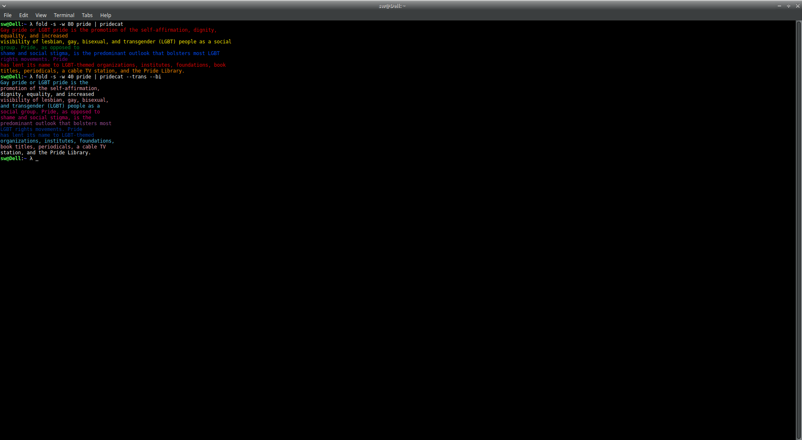

# 🏳️‍🌈 pridecat

Like **cat**, but more colorful - inspired by [lolcat](https://github.com/busyloop/lolcat).

Colorize your terminal output with pride!



## Flags

```
--asexual,--ace
	Asexual pride flag designed by AVEN user 'standup' in 2010

--bisexual,--bi
	Bisexual pride flag designed by Michael Page in 1998

--genderqueer
	Genderqueer pride flag designed by Marilyn Roxie in 2011

--lgbt
	Classic 6-color rainbow flag popular since 1979

--lgbt-1978
	Original 8-color rainbow flag designed by Gilbert Baker in 1978

--lgbtpoc
	POC-inclusive rainbow flag designed by Philadelphia City Council in 2017

--lipstick-lesbian,--pink-lesbian
	Lipstick lesbian pride flag designed by Natalie McCray in 2010

--new-lesbian
	New lesbian pride flag designed by Emily Gwen in 2018

--nonbinary,--enby,--nb
	Non-binary pride flag designed by Kye Rowan in 2014

--pansexual,--pan
	Pansexual pride flag designed by Evie Varney in 2010

--transgender,--trans
	Transgender pride flag designed by Monica Helms in 1999
```

## Additional options

```
-f,--force
	Force color even when stdout is not a tty

-t,--truecolor
	Force truecolor output (even if the terminal doesn't seem to support it)

-h,--help
	Display the help page
```

## Building

On any *nix system it _should_ be as simple as:

```
git clone https://github.com/lunasorcery/pridecat.git
cd pridecat
make && make install
```

This depends on a recent (C++11) C++ compiler being available. If you encounter issues, please let me know.

## Windows support?

There's currently no Windows-compatible build setup, but the code should work under the notable windows terminals if you compile it with cl.exe. Tested in cmd, PowerShell, and Windows Terminal.

It also appears to work out-of-the-box in WSL.

## License

**pridecat** is made available under the Creative Commons Attribution-NonCommercial 4.0 International license.